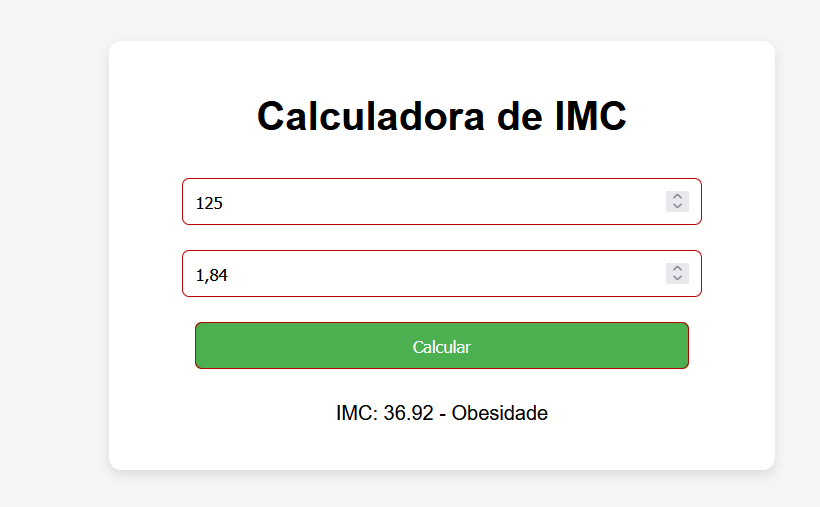

<h1 align="center">🧮 Calculadora de IMC</h1>

  <

  <b>Projeto simples e funcional para calcular o Índice de Massa Corporal (IMC), desenvolvido com HTML, CSS e JavaScript.</b>

---

## 🚀 Demonstração
🔗 **Acesse online:** [Clique aqui]( https://caiocesarmota9-boop.github.io/imc-calculator/)  

---

## 🛠 Tecnologias Utilizadas
- 🎨 **HTML5** → Estrutura da página  
- 🎭 **CSS3** → Estilização e layout  
- ⚡ **JavaScript** → Lógica do cálculo do IMC  

---

## 📌 Funcionalidades
✔ Inserir peso (kg) e altura (m)  
✔ Calcular automaticamente o IMC  
✔ Exibir classificação (abaixo do peso, normal, sobrepeso, obesidade)  
✔ Interface simples e responsiva  

---

## 📂 Estrutura do Projeto
